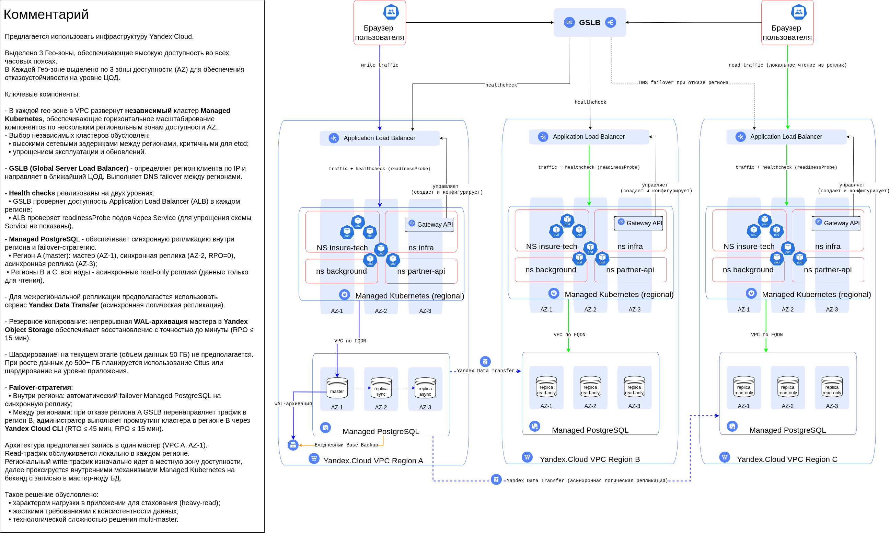
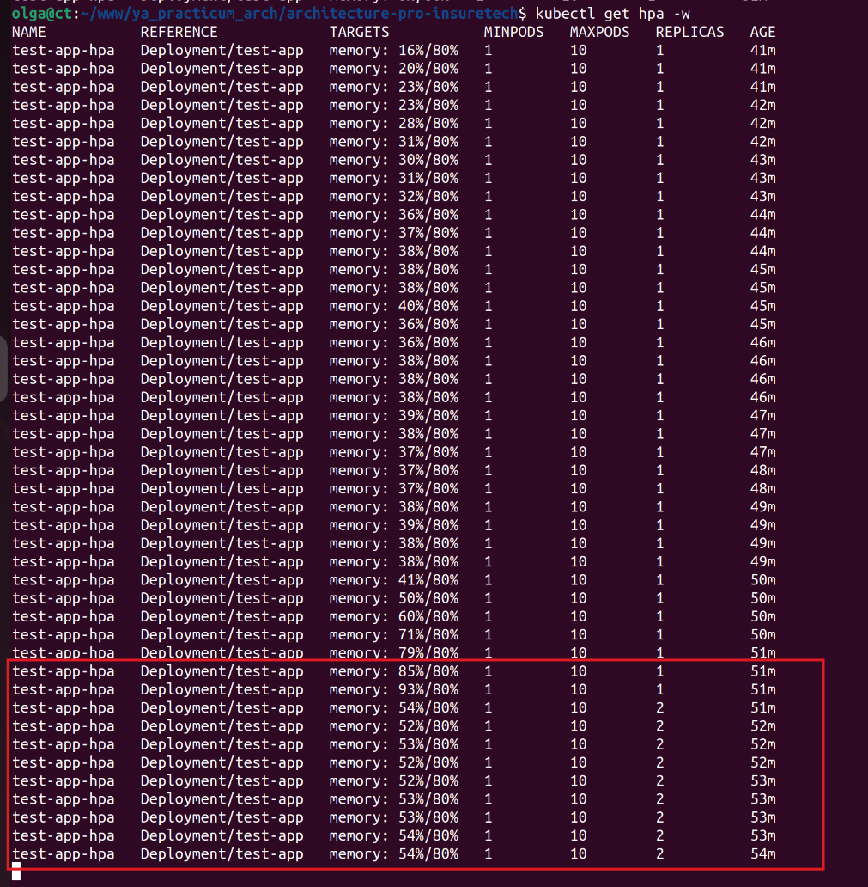
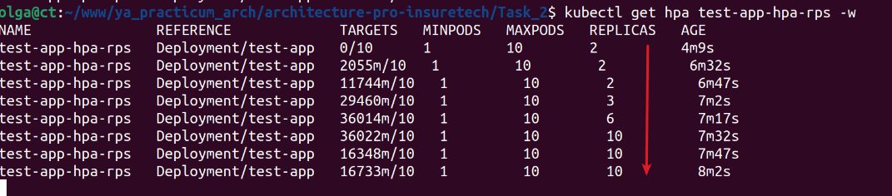
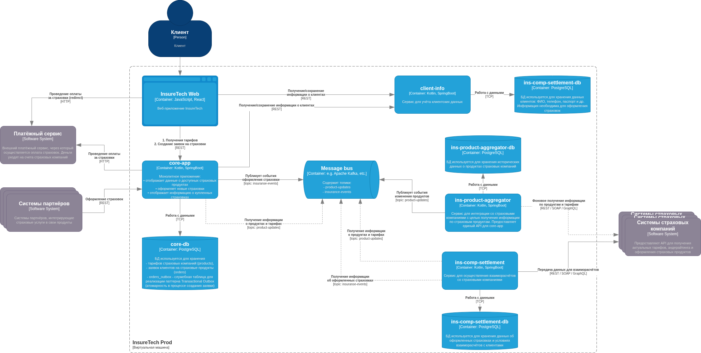
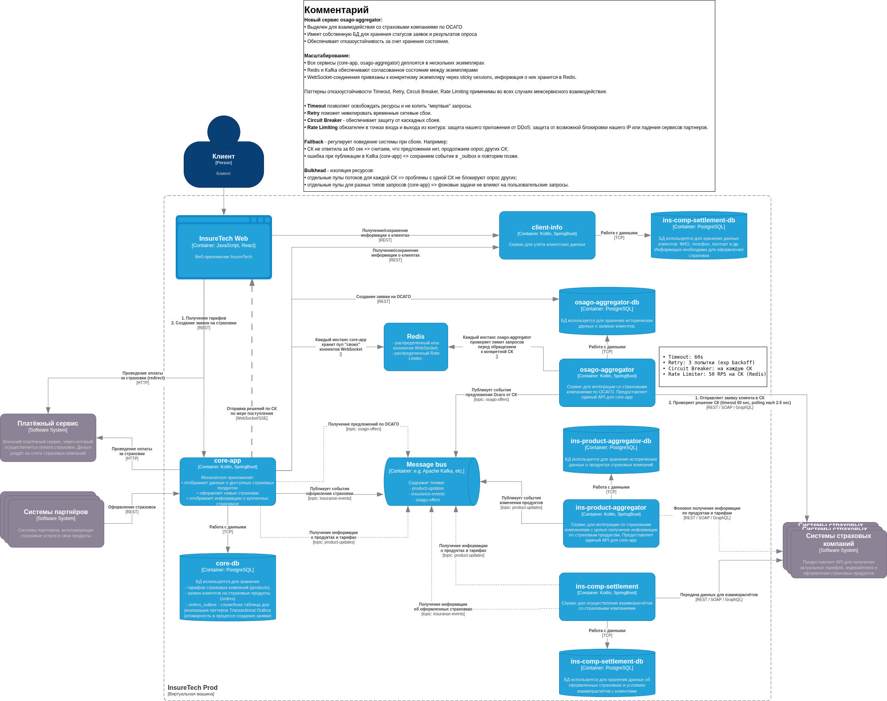

# Проектирование highload-архитектуры для агрегатора страховых продуктов InsureTech

## Задание 1. Проектирование технологической архитектуры
### Архитектура As-Is
1. Для деплоя всех приложений используется кластер Kubernetes, расположенный в одной зоне доступности.
2. В качестве базы данных используется PostgreSQL. Каждый сервис, использующий БД, имеет отдельную схему данных. БД развёрнута на отдельной ВМ в единственном экземпляре.
3. Взаимодействие между фронтендом и бэкендом происходит посредством REST.
4. API предоставляет партнёрам доступ напрямую через LoadBalancer Kubernetes, который доступен в сети Интернет.
5. Бэкенд-приложение интегрировано с пятью страховыми компаниями.
6. На текущий момент сервис хранит ограниченный набор данных, который включает в себя:
   - базовую информацию о клиентах — ФИО, контакты, документы,
   - информацию о продуктах и тарифах,
   - историю заявок клиентов.
7. Общий объём данных, которые хранятся в системе, равен 50 GB.

### Проблемы
1. Сайт медленно загружает страницы.
2. Нарушается SLA для B2B-клиентов (отсутствие лимитирования запросов апи)
3. Низкая доступность приложения.
4. Команда узнает о проблемах от пользователей.

### Цели бизнеса
- Компания хочет сделать упор на развитие в регионах РФ. 
- Ожидается существенный прирост пользователей (большая рекламная кампания).

### Целевые показатели доступности
- Нужно обеспечить бесперебойную работу сервиса 24/7.
- RTO — 45 мин., RPO — 15 мин. 
- Доступность приложения должна быть равна 99,9%.
- Нужна высокая гео-доступность из всех часовых поясов.

**RTO (Recovery Time Objective)** - время, необходимое для восстановления работоспособности системы.

**RPO (Recovery Point Objective)** - это максимальный объём данных, который компания может позволить себе потерять в случае сбоя. Это измеряется временем, прошедшим с момента последнего резервного копирования до сбоя системы.

### Узкие места
#### Единая точка отказа
- **База данных:** Один инстанс PostgreSQL на отдельной ВМ. Если ВМ выйдет из строя или произойдет сбой диска, сервис полностью потеряет работоспособность на все время простоя.
- **Зона доступности:** Кластер находится в одной зоне доступности. В случае аварии в ЦОДе сервис станет недоступен полностью.
- Отсутствует Failover-стратегия для обеспечения высокой доступности.
#### Проблемы с восстановлением
- Отсутствует мониторинг и алертинт, поэтому команда не узнает вовремя о проблемах.
- Целевые показатели RTO/RPO невозможно достичь на текущей архитектуре.
#### Географическая зависимость времени загрузки
- Приложение размещено в одной зоне доступности.
- У пользователей из разных регионов будет разное время отклика из-за сетевых задержек.
#### Масштабируемость
- Вертикальное масштабирование может спасать некоторое время, но при росте нагрузки БД станет узким местом всего сервиса.
#### Безопасность 
- Прямой доступ партнерам через LoadBalancer Kubernetes является рискованным с точки зрения безопасности (DDoS, неавторизованный доступ).
- Отсутствие Rate Limiting приводит к тому, что "толстый" клиент забивает собой канал, ограничивая доступность API для остальных клиентов.




## Задание 2. Динамическое масштабирование контейнеров
```bash
sudo k3s server start
```

```bash
docker run --rm --network="host" \
  -v $(pwd):/mnt/locust \
  --name locust-test \
  locustio/locust \
  -f /mnt/locust/locustfile.py
```




## Задание 3. Переход на Event-Driven архитектуру

[Анализ проблем и рисков](./Task_3/Анализ%20проблем%20и%20рисков.md)

#### Целевая архитектура


## Задание 4. Проектирование продажи ОСАГО
[Анализ требований](./Task_4/Анализ%20требований.md)

